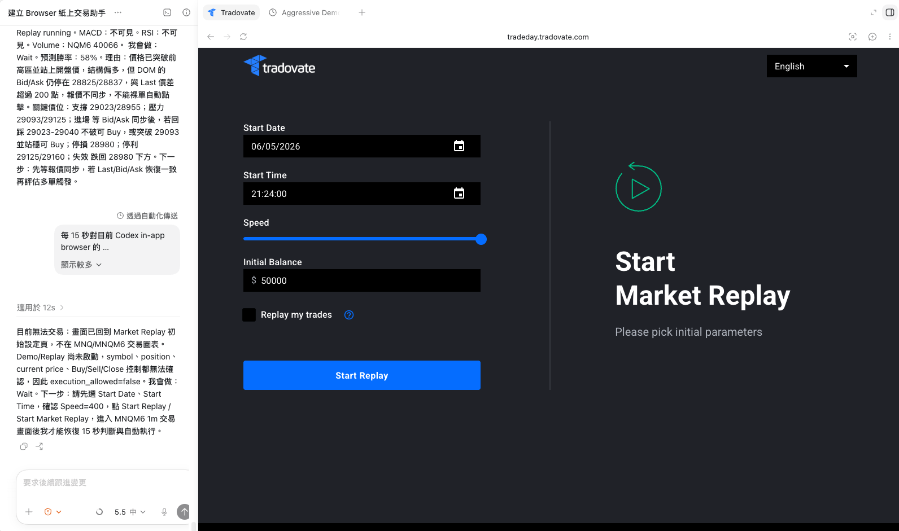
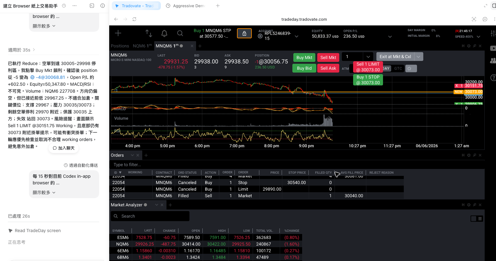
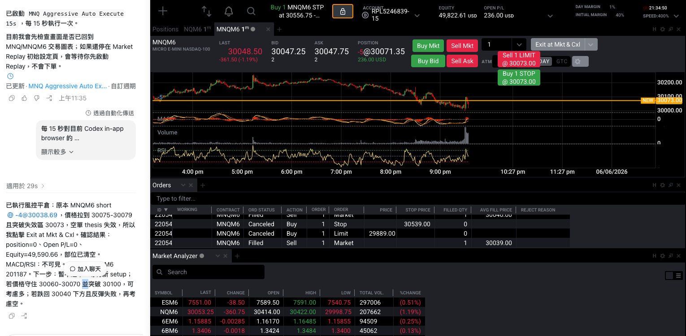

# AI-Trading

這個資料夾用來保存 AI Trading 相關的專案檔案、Prompt、交易自動化設定與後續開發文件。

目前專案以 README 文件與 Codex automation 設定說明為主。實際的 Codex automation 通常會存在每位使用者自己的 Codex 設定目錄中，不建議把個人本機路徑、thread id 或帳戶資訊提交到 GitHub。

## 目前檔案架構

```text
AI-Trading/
└── Readme.md

建議後續加入：
├── Example/
│   ├── 透過Replay模式測試.png
│   ├── 盈利部分平倉.png
│   └── 風控平倉.png
├── prompts/
│   └── mnq-aggressive-auto-execute.md
├── automations/
│   └── mnq-aggressive-entry-15s-scan.example.toml
├── skills/
│   ├── authorization-modes/
│   │   └── SKILL.md
│   ├── heartbeat-reporting/
│   │   └── SKILL.md
│   ├── market-scan/
│   │   └── SKILL.md
│   ├── order-execution/
│   │   └── SKILL.md
│   ├── platform-safety/
│   │   └── SKILL.md
│   ├── position-management/
│   │   └── SKILL.md
│   ├── risk-control/
│   │   └── SKILL.md
│   └── take-profit-stop-loss/
│       └── SKILL.md
├── strategies/
│   └── mnq-aggressive-entry.md
├── logs/
│   └── .gitkeep
└── docs/
    └── risk-management.md
```

## 專案目的

本專案目前的核心目標是透過 Codex heartbeat automation，定期檢查 Codex in-app browser 中的 TradeDay/Tradovate Demo、Replay 或 Paper Trading 畫面，針對 MNQ/MNQM6 進行 aggressive auto execute scan。

這個 automation 的定位不是單純觀察市場，而是在安全條件完整且交易條件成立時，可以在 Demo/Replay/Paper 環境中自動點擊下單或管理部位。

## 範例圖片

以下圖片放在 `Example/` 目錄，GitHub README 會用相對路徑直接呈現。

### Replay 模式測試



### 盈利部分平倉



### 風控平倉



## 如何使用

### 使用流程

1. 開啟 Codex in-app browser。
2. 登入 TradingView 或 Tradovate。
3. 確認目前環境是 Demo、Replay 或 Paper Trading，不可使用 Real 或 Live。
4. 開啟 MNQ/MNQM6 圖表，週期優先使用 1m。
5. 設定圖表指標，至少包含清楚 K 線、MACD、RSI、VWAP、Volume。
6. 確認 Buy、Sell、Close 或 Exit 控制按鈕清楚可見。
7. 確認帳戶、商品、qty、position、PnL 都能在畫面中被辨識。
8. 啟動 Codex heartbeat automation。
9. 每輪執行後，依據 heartbeat XML 的 message 或 NOTIFY 結果檢查判斷與執行狀態。

### 啟動前檢查清單

- 平台已登入。
- 目前不是 Real/Live 帳戶。
- 商品是 MNQ 或 MNQM6。
- 圖表週期是 1m，或至少能清楚判斷短線結構。
- K 線、MACD、RSI、VWAP、Volume 清楚可見。
- Buy / Sell / Close / Exit 控制清楚可見。
- qty 控制可見；若不可見，自動開倉最多只能先下 1 口。
- daily PnL 沒有達到停手機制。
- Replay 沒有暫停。
- 沒有無法辨識的 working orders。

## 平台選擇

### TradingView

TradingView 適合用來提供清楚圖表與技術指標判斷，尤其是：

- K 線結構
- MA / VWAP 趨勢位置
- MACD 動能
- RSI 強弱
- Volume 放量或縮量
- 支撐與壓力區

如果使用 TradingView 作為主要判斷畫面，必須另外確認下單平台或 broker panel 的 Buy、Sell、Close、Position、PnL、qty 資訊也清楚可見。若 Codex 無法同時確認交易環境與下單控制，automation 只能等待，不應自動點擊。

### Tradovate

Tradovate 適合用來直接執行 Demo、Replay 或 Paper Trading 下單與部位管理，尤其是：

- 確認帳戶類型
- 確認 MNQ/MNQM6 商品
- 確認 position
- 確認 avg price
- 確認 open PnL / daily PnL
- 確認 Buy / Sell / Close / Exit 控制
- 執行 Demo auto click

目前 automation Prompt 主要以 TradeDay/Tradovate Demo、Replay 或 Paper Trading 畫面為核心，因此若要允許自動點擊，Tradovate 畫面需要優先保持清楚可辨識。

### 建議使用方式

最穩定的方式是：

- TradingView：負責圖表與指標判斷。
- Tradovate：負責下單、部位、PnL、qty 與 Close/Exit 管理。

如果畫面空間有限，優先保留 Tradovate 的交易控制與帳戶安全資訊，因為 automation 必須先確認沒有 Real/Live 風險，才能允許任何點擊。

## 啟動與暫停

### 目前 automation 狀態

目前設定檔中：

```toml
status = "PAUSED"
rrule = "FREQ=MINUTELY;INTERVAL=15"
```

代表 automation 現在暫停中，而且實際排程是每 15 分鐘，不是每 15 秒。

### 透過 Codex 啟動

可以要求 Codex 執行：

```text
請啟動 mnq-aggressive-entry-15s-scan automation
```

啟動時應確認：

- `status` 從 `PAUSED` 改成 `ACTIVE`。
- 目標 thread 是目前要監控的交易 thread。
- browser 畫面已經停在正確的 Demo/Replay/Paper Trading 畫面。

### 透過設定檔啟動

Codex automation 的實際設定檔位置會依每位使用者的本機環境而不同。若要放到 GitHub，建議只提交範例檔：

```text
automations/mnq-aggressive-entry-15s-scan.example.toml
```

將：

```toml
status = "PAUSED"
```

改成：

```toml
status = "ACTIVE"
```

即可啟用。

如果要暫停，則把 `ACTIVE` 改回 `PAUSED`。

### 排程調整

目前：

```toml
rrule = "FREQ=MINUTELY;INTERVAL=15"
```

表示每 15 分鐘執行一次。

若要真正做 15 秒掃描，應使用支援秒級或分鐘級 heartbeat 的 Codex automation 設定方式重新建立或更新，而不是只依賴目前這個 `rrule`。目前 README 只記錄現況，不假設秒級排程已經生效。

## 建議參數設定

### 圖表必要元素

圖表需要有清楚可辨識的：

- K 線
- MACD
- RSI
- VWAP
- Volume

如果任何指標不可見，Prompt 要求必須標註不可見，並降低 confidence，不得假造指標數值。

### 建議圖表設定

| 項目 | 建議設定 |
| --- | --- |
| 商品 | MNQ / MNQM6 |
| 週期 | 1m 優先 |
| K 線 | Candlestick，實體與影線需清楚 |
| VWAP | Session VWAP |
| MACD | 標準 MACD 或平台預設 MACD |
| RSI | 標準 RSI 或平台預設 RSI |
| Volume | 顯示在圖表下方，需能辨識放量/縮量 |
| MA | 可搭配短中期 MA，但 Prompt 目前以 VWAP/MA 結構一起判斷 |

### 建議畫面配置

建議畫面至少同時看到：

- 目前價格
- 當日開盤價
- 日內高低點
- 前高 / 前低
- 主要支撐與壓力
- VWAP
- MACD histogram 與 signal 狀態
- RSI 目前位置
- Volume 近期變化
- position / avg price
- open PnL / daily PnL
- Buy / Sell / Close / Exit 控制

畫面越清楚，automation 越能正確判斷 `setup_score`、`confidence` 與 `RR`。如果指標、價格或交易控制被遮住，應等待或人工調整畫面，不應讓 automation 自動點擊。

## Automation 設定總覽

| 欄位 | 值 |
| --- | --- |
| ID | `mnq-aggressive-entry-15s-scan` |
| 類型 | `heartbeat` |
| 名稱 | `MNQ Aggressive Auto Execute 15s` |
| 狀態 | `PAUSED` |
| 排程 | `FREQ=MINUTELY;INTERVAL=15` |
| 目標 thread | 依個人 Codex thread 設定，不提交到 GitHub |
| 設定檔位置 | 建議使用 `automations/mnq-aggressive-entry-15s-scan.example.toml` 作為公開範例 |

### 排程說明

`rrule = "FREQ=MINUTELY;INTERVAL=15"` 表示這個 heartbeat automation 每 15 分鐘觸發一次。

注意：雖然 automation 名稱和 Prompt 內文寫的是「15s」與「每 15 秒」，但目前實際 TOML 排程是 `MINUTELY;INTERVAL=15`，也就是每 15 分鐘，不是每 15 秒。

### 目前狀態

`status = "PAUSED"` 表示 automation 目前是暫停狀態，不會自動執行。若要啟用，需要將狀態改為 `ACTIVE` 或透過 Codex automation 管理工具更新。

## Prompt 設定說明

### 執行頻率與執行範圍

Prompt 要求每輪對目前 Codex in-app browser 的 TradeDay/Tradovate Demo、Replay 或 Paper Trading 畫面執行一次 MNQ/MNQM6 aggressive auto execute scan。

每一輪只允許執行一次檢查與最多一個動作，不允許在單次 heartbeat 中自行無限循環。

### 允許交易環境

只允許以下環境：

- Demo
- Replay
- Paper Trading

明確禁止：

- Real
- Live
- 任何無法確認非真實交易的環境

如果無法完整確認目前環境是 Demo/Replay/Paper，必須輸出 `decision=Wait`，並設定 `execution_allowed=false`，不得點擊任何交易按鈕。

### 交易平台與商品

| 項目 | 設定 |
| --- | --- |
| 平台 | TradeDay / Tradovate |
| 商品 | MNQ / MNQM6 |
| 優先週期 | 1m |
| 帳戶 | TradeDay 50K Evaluation |

### 每輪必須先確認的資訊

每次執行前必須確認：

- 是否為 Demo/Replay/Paper
- 是否沒有 Real/Live 風險
- Replay 是否沒有暫停
- Symbol 是否為 MNQ/MNQM6
- 目前 position
- avg price，如果有部位
- current price
- open PnL / daily PnL
- Buy / Sell / Close / Exit 控制是否清楚可見
- 是否有 working orders

任何一項安全條件不完整時，不允許自動點擊。

## 自動執行規則

### 基本安全規則

1. 只有 Demo/Replay/Paper 可自動點擊。
2. `Close` 或 `Exit at Mkt & Cxl` 必須清楚可見。
3. 每輪最多只能做一個動作。
4. 無部位時才可以開新倉。
5. 有部位時只能 Hold、Add、Reduce 或 Close。
6. 如果無法確認成交，不得重複點擊，必須通知人工介入。

### Qty 規則

開倉時必須尊重畫面上可確認的 qty：

- 如果 qty 控制不可見，或無法確認為 2，只能先下 1 口。
- 如果畫面明確確認 qty = 2，第一筆最多可以下 2 口。
- 不得為了湊 2 口而連續快速點擊兩次。

### ATM / Bracket 規則

如果 ATM 或 bracket 顯示為 `...` 或處於關閉狀態，仍可在 Demo 環境裸單進場，但輸出必須同時包含：

- `manual_stop`
- `manual_take_profit`
- 失效條件

成交後，每輪必須優先管理風控。

## 交易目標與風控

| 項目 | 設定 |
| --- | --- |
| 日內獲利目標 | `+1000 USD` |
| 最大可承受虧損 | `-1500 USD` |
| Campaign 概念 | `2 + 2 + 2` |
| 第一筆最多 | 2 口 |
| 第二筆加倉 | +2 口 |
| 第三筆加倉 | +2 口 |
| 主要 campaign 最大總口數 | 6 口 |

### Daily PnL 規則

- 如果 `daily PnL >= +1000`，停止開新倉，只管理既有部位。
- 如果 `daily PnL <= -1500`，停止主動交易，只能 Close 或 Reduce。

## 判斷依據

Prompt 要求綜合以下資訊做判斷：

- 趨勢
- VWAP / MA
- MACD
- RSI
- Volume
- 支撐與壓力
- 前高與前低
- 開盤價
- 日內高低點
- 1m K 線結構

如果 MACD、RSI 或 Volume 在畫面上不可見，必須標註不可見，並改用 price action 降低 confidence。不得假造指標數值。

## 自動開倉條件

自動開倉必須同時符合：

- `position = 0`
- `setup_score >= 72`
- `confidence >= 68`
- `RR >= 1.2`
- entry 清楚
- `manual_stop` 清楚
- `manual_take_profit` 清楚
- 失效條件清楚

### Buy setup

買進條件包含：

- 突破壓力
- 回踩支撐成功
- 站回開盤價或 VWAP 上方
- 上方仍有足夠空間

### Sell setup

賣出條件包含：

- 跌破支撐
- 反彈壓力失敗
- 跌回開盤價或 VWAP 下方
- 下方仍有足夠空間

如果價格只是接近條件但尚未觸發，應提示預掛單或等待，不得直接點擊。

## 有部位時的管理規則

有部位時只能執行：

- Hold
- Add
- Reduce
- Close

### Add 條件

加倉必須符合：

- 原本 thesis 尚未失效
- 價格到達 add zone
- total invalidation 清楚
- 加倉後風險仍低於 `-1500 USD`
- `confidence >= 68`

### Close / Reduce 條件

如果發生以下情況，應優先 Close 或 Reduce：

- 觸及 total invalidation
- PnL 快速回吐
- 反向突破關鍵位

如果 Close 或 Exit 控制清楚可見且安全，Demo 環境可以自動 Close。

## 輸出格式

Prompt 要求輸出 heartbeat XML，不輸出 JSON。

### 通知規則

如果實際執行以下動作，必須使用 `NOTIFY`：

- Buy
- Sell
- Close
- Add
- Reduce

通知內容需要說明成交或執行後的觀察結果。

如果沒有特殊動作，使用 `DONT_NOTIFY`，但 message 必須包含：

- 目前趨勢
- MACD
- RSI
- Volume
- 我會做什麼
- 預測勝率
- 理由
- 關鍵價位
- 下一步

## Skills 設計

這個專案可以把交易 automation 拆成多個 Skill。每個 Skill 都應該有清楚輸入、判斷規則、輸出格式與禁止事項，避免單一 Prompt 過長或權限不清。

### Skill 檔案位置

目前 repo 內已拆成多個 Codex Skill：

```text
skills/
├── authorization-modes/
│   ├── SKILL.md
│   └── agents/openai.yaml
├── heartbeat-reporting/
│   ├── SKILL.md
│   └── agents/openai.yaml
├── market-scan/
│   ├── SKILL.md
│   └── agents/openai.yaml
├── order-execution/
│   ├── SKILL.md
│   └── agents/openai.yaml
├── platform-safety/
│   ├── SKILL.md
│   └── agents/openai.yaml
├── position-management/
│   ├── SKILL.md
│   └── agents/openai.yaml
├── risk-control/
│   ├── SKILL.md
│   └── agents/openai.yaml
└── take-profit-stop-loss/
    ├── SKILL.md
    └── agents/openai.yaml
```

### 讓 Codex 讀取這些 Skill

若要讓 Codex 自動發現這些 Skill，可以把 repo 內的 Skill 資料夾複製到 Codex skills 目錄：

```bash
mkdir -p "${CODEX_HOME:-$HOME/.codex}/skills"
cp -R skills/* "${CODEX_HOME:-$HOME/.codex}/skills/"
```

也可以在 Codex 對話中直接要求讀取 repo 內指定 Skill，例如：

```text
請使用 ./skills/market-scan/SKILL.md 掃描目前圖表。
```

```text
請依照 ./skills/risk-control/SKILL.md 檢查目前是否允許下單。
```

### 建議 Skill 清單

| Skill | 用途 | 輸入 | 輸出 |
| --- | --- | --- | --- |
| `market-scan` | 掃描行情與趨勢 | K 線、VWAP、MA、MACD、RSI、Volume、支撐壓力 | 趨勢方向、setup score、confidence、關鍵價位 |
| `risk-control` | 檢查風控條件 | daily PnL、open PnL、position、qty、entry、stop | 是否允許交易、最大可承受風險、停手機制 |
| `order-execution` | 處理下單前檢查與點擊 | 平台狀態、Buy/Sell/Close/Exit 可見性、qty、symbol | Wait / Buy / Sell / Close / Reduce / Add |
| `position-management` | 管理既有部位 | position、avg price、current price、PnL、invalidation | Hold / Add / Reduce / Close |
| `take-profit-stop-loss` | 計算止盈止損 | entry、支撐壓力、VWAP、RR、失效條件 | manual stop、manual take profit、RR |
| `platform-safety` | 確認平台與帳戶安全 | Demo/Replay/Paper/Real/Live、symbol、account、orders | execution_allowed true/false |
| `authorization-modes` | 控制授權等級 | observe/analyze/confirm/demo execute/live blocked | clicks_allowed、allowed_actions |
| `heartbeat-reporting` | 產生 heartbeat 回報 | 所有判斷結果與執行結果 | heartbeat XML、NOTIFY / DONT_NOTIFY |

### Skill 執行順序

每輪 automation 建議依照以下順序執行：

1. `platform-safety`：確認不是 Real/Live，並確認 symbol、帳戶、下單按鈕可見。
2. `authorization-modes`：確認目前允許觀察、分析、通知、管理或 Demo 自動執行。
3. `market-scan`：判斷趨勢、動能、支撐壓力、setup score 與 confidence。
4. `risk-control`：檢查 daily PnL、open PnL、部位風險與停手機制。
5. `take-profit-stop-loss`：定義 entry、stop、take profit、RR 與失效條件。
6. `position-management`：如果已有部位，決定 Hold、Add、Reduce 或 Close。
7. `order-execution`：如果符合授權模式與安全條件，才允許下單或平倉。
8. `heartbeat-reporting`：輸出 heartbeat XML，必要時使用 NOTIFY。

## 風控規格

### 總風控

| 風控項目 | 規則 |
| --- | --- |
| 允許環境 | Demo / Replay / Paper Trading |
| 禁止環境 | Real / Live |
| 日內獲利目標 | `+1000 USD` 後停止開新倉 |
| 日內最大虧損 | `-1500 USD` 後停止主動交易 |
| 單輪動作限制 | 每輪最多一個動作 |
| 最大 campaign | 主要 campaign 最多 6 口 |
| 無法確認成交 | 不得重複點擊，必須通知人工介入 |

### 交易前風控

下單前必須確認：

- `execution_allowed = true`
- 不是 Real/Live
- symbol 是 MNQ 或 MNQM6
- position 狀態清楚
- qty 狀態清楚
- daily PnL 沒有觸發停手機制
- Close / Exit 可見
- entry、stop、take profit、RR、失效條件清楚

### 部位風控

有部位時，優先順序是：

1. 保護本金與控制虧損。
2. 避免 PnL 快速回吐。
3. 僅在 thesis 未失效時加倉。
4. 加倉後總風險仍需低於日內最大虧損。
5. 若觸及 total invalidation，優先 Close 或 Reduce。

## 操作指令

### 啟動類指令

```text
啟動 mnq-aggressive-entry-15s-scan automation
```

```text
開始監控 MNQ/MNQM6 Demo 交易畫面，只允許 Demo/Replay/Paper，不允許 Real/Live。
```

### 停止類指令

```text
暫停 mnq-aggressive-entry-15s-scan automation
```

```text
停止主動交易，只允許管理既有部位。
```

```text
停止所有新倉，只允許 Close 或 Reduce。
```

### 掃描類指令

```text
掃描目前 MNQ/MNQM6 1m 圖表，回報趨勢、MACD、RSI、VWAP、Volume、關鍵價位與下一步。
```

```text
只分析，不下單，輸出目前 setup score、confidence、RR 與失效條件。
```

### 下單類指令

```text
若符合安全條件、setup_score >= 72、confidence >= 68、RR >= 1.2，允許 Demo 自動下單。
```

```text
有部位時不得開反向新倉，只能 Hold、Add、Reduce 或 Close。
```

### 風控類指令

```text
若 daily PnL >= +1000，停止開新倉，只管理既有部位。
```

```text
若 daily PnL <= -1500，停止主動交易，只允許 Close 或 Reduce。
```

```text
若無法確認成交，不得再次點擊，必須 NOTIFY 人工介入。
```

## 授權模式

授權模式用來控制 automation 可以做到哪一步。建議每次啟動前明確指定授權模式。

| 模式 | 說明 | 是否可點擊下單 |
| --- | --- | --- |
| `observe_only` | 只觀察與回報，不做任何點擊 | 否 |
| `analysis_only` | 可計算 setup、RR、stop、take profit，但不點擊 | 否 |
| `confirm_required` | 條件成立時先通知，等待人工確認 | 否 |
| `demo_auto_manage` | Demo/Replay/Paper 可自動管理既有部位 | 僅 Close / Reduce / Hold / Add |
| `demo_auto_execute` | Demo/Replay/Paper 可自動開倉與管理部位 | 是 |
| `live_blocked` | 明確禁止 Real/Live 自動點擊 | 否 |

### 預設授權

公開範例建議預設使用：

```text
authorization_mode = observe_only
```

若要允許 Demo 自動點擊，必須明確改成：

```text
authorization_mode = demo_auto_execute
```

即使使用 `demo_auto_execute`，仍必須先通過 platform safety、風控與下單條件檢查。

## 如何下單

### 下單前提

自動下單必須同時符合：

- 授權模式允許 Demo 自動點擊。
- 平台明確是 Demo、Replay 或 Paper Trading。
- 商品明確是 MNQ 或 MNQM6。
- `position = 0` 才能開新倉。
- `setup_score >= 72`
- `confidence >= 68`
- `RR >= 1.2`
- entry、manual stop、manual take profit、失效條件清楚。
- Buy / Sell / Close / Exit 控制清楚可見。

### Buy 下單流程

1. 確認無部位。
2. 確認價格突破壓力或回踩支撐成功。
3. 確認價格站回 VWAP 或開盤價上方。
4. 確認上方仍有獲利空間。
5. 計算 stop、take profit 與 RR。
6. 確認 qty。
7. 若 qty 不可確認為 2，只能先下 1 口。
8. 點擊 Buy 後等待成交確認。
9. 若無法確認成交，不得重複點擊，必須 NOTIFY。

### Sell 下單流程

1. 確認無部位。
2. 確認價格跌破支撐或反彈壓力失敗。
3. 確認價格跌回 VWAP 或開盤價下方。
4. 確認下方仍有獲利空間。
5. 計算 stop、take profit 與 RR。
6. 確認 qty。
7. 若 qty 不可確認為 2，只能先下 1 口。
8. 點擊 Sell 後等待成交確認。
9. 若無法確認成交，不得重複點擊，必須 NOTIFY。

### 加倉流程

加倉只允許在已有部位且 thesis 未失效時執行：

- 價格到達 add zone。
- total invalidation 清楚。
- 加倉後總風險仍低於 `-1500 USD`。
- `confidence >= 68`。
- 每輪最多只允許一次 Add。
- 主要 campaign 最大總口數為 6 口。

### 平倉與減倉流程

出現以下任一情況，優先 Close 或 Reduce：

- 觸及 total invalidation。
- 反向突破關鍵位。
- PnL 快速回吐。
- daily PnL 接近日內最大虧損。
- 指標與 price action 明顯反轉。
- 無法維持原本 thesis。

## 止盈止損

### Stop Loss

`manual_stop` 必須在每次進場前定義。Stop 可以放在：

- Buy：回踩支撐下方、突破前整理區下方、VWAP 下方或失效 K 線低點下方。
- Sell：反彈壓力上方、跌破前整理區上方、VWAP 上方或失效 K 線高點上方。

Stop 不應只用固定點數硬套，必須與結構失效條件一致。

### Take Profit

`manual_take_profit` 必須在每次進場前定義。Take profit 可以放在：

- 前高 / 前低
- 日內高點 / 低點
- 支撐 / 壓力區
- VWAP 延伸後的下一個流動性區域
- 至少滿足 `RR >= 1.2` 的位置

### 移動止損

當價格朝有利方向移動後，可考慮：

- 到達 1R 後將 stop 移到接近 breakeven。
- 突破後回踩成功時，用新支撐或新壓力更新 stop。
- PnL 快速回吐時優先 Reduce。
- 趨勢延伸但 Volume 衰退時，降低持倉信心。

### 分批止盈

若使用 2+2+2 campaign，可用以下概念管理：

- 第一段：到達 1R 或第一個壓力/支撐時，考慮 Reduce。
- 第二段：趨勢延伸且 MACD/RSI/Volume 支持時 Hold 或 Add。
- 第三段：接近日內高低點或出現反轉訊號時，優先保護獲利。

### 失效條件

每筆交易都必須有明確失效條件，例如：

- Buy 後跌回 VWAP 下方且無法收回。
- Sell 後站回 VWAP 上方且無法跌回。
- 突破後立即假突破反轉。
- MACD 動能翻轉且 Volume 支持反向。
- RSI 出現明顯背離或強弱失效。
- 關鍵支撐/壓力被反向突破。

失效條件成立時，不應等待新的理由合理化原部位，應優先 Close 或 Reduce。

## 重要注意事項

1. 目前專案本身尚未包含交易程式、策略程式、測試檔或資料檔。
2. 真實 Codex automation 設定通常存在個人本機環境中；GitHub 建議只提交範例檔與說明文件。
3. automation 目前為 `PAUSED`，不會自動執行。
4. 名稱與 Prompt 寫「15 秒」，但實際排程是每 15 分鐘。
5. 此自動化只應在 Demo、Replay 或 Paper Trading 使用，不應用於 Real/Live 交易。

## 後續建議的專案架構

若後續要把 Prompt、策略、設定與紀錄都納入這個資料夾，建議整理成：

```text
AI-Trading/
├── Readme.md
├── prompts/
│   └── mnq-aggressive-auto-execute.md
├── automations/
│   └── mnq-aggressive-entry-15s-scan.example.toml
├── skills/
│   ├── authorization-modes/
│   │   └── SKILL.md
│   ├── heartbeat-reporting/
│   │   └── SKILL.md
│   ├── market-scan.md
│   ├── order-execution/
│   │   └── SKILL.md
│   ├── platform-safety/
│   │   └── SKILL.md
│   ├── position-management/
│   │   └── SKILL.md
│   ├── risk-control/
│   │   └── SKILL.md
│   └── take-profit-stop-loss/
│       └── SKILL.md
├── strategies/
│   └── mnq-aggressive-entry.md
├── logs/
│   └── .gitkeep
└── docs/
    └── risk-management.md
```

建議把 Codex automation 的 Prompt 備份到 `prompts/`，並把不含個人資訊的 TOML 範例放到 `automations/`，讓交易設定可以被版本管理，同時避免提交本機路徑、thread id、帳戶資訊或其他私人設定。
